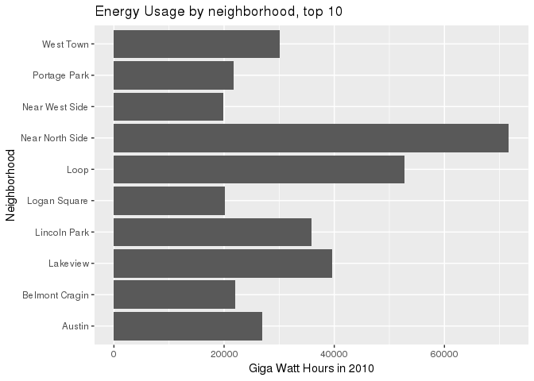
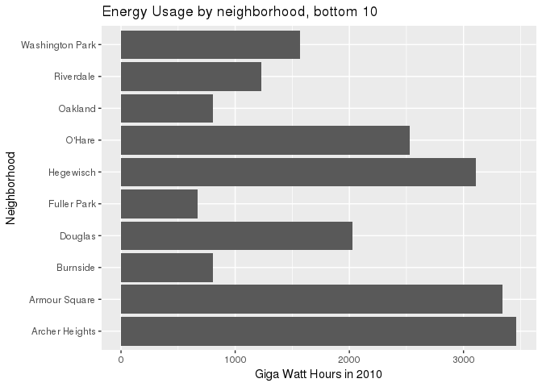
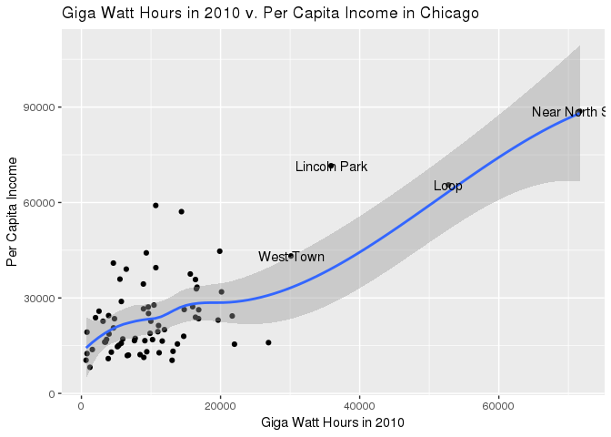
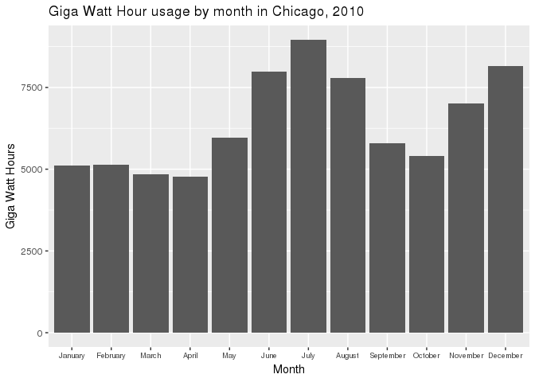

Exploring Energy Use in Chicago
================
Paul Alves
11/4/2018

Exploring the energy usage in the City of Chicago
=================================================

Introduction
------------

The idea was to explore energy usage in the city of Chicago using available data from the online data portal. The data includes the total energy usage for the city of Chicago in 2010. It includes data such as neighborhoods, building types, occupancy, month, and many more variables. This makes it simple to observe many potential variables. The analysis will observe in particular, the energy usage of different neighborhoods. It will also observe this data correlated with income levels. Finally, an analysis of energy usage per month is included. This exploratory analysis will present on which neighorhoods need energy efficiency improvements and during which months energy usage is high. The city could then implement certain programs in different areas at different times of year for the best impact.

Energy use by community area
----------------------------

A potential analysis that can easily be performed is energy use by community area. This is possible by counting the community area names and total kilowatt hours. Looking into which community uses the most energy is a good initial starting point for an analysis. However, due to the many different neighborhoods, it would not be feasible to display them all in a single graph. Instead, a glance at the top and bottom 10 energy using neighborhoods will suffice. 

The near north side community has the most energy usage by far. This could be due to a number of possible factors. The neighborhood includes the Magnificent Mile, Streeterville, and Gold Coast areas. This has many stores, shopping malls, and hotels. These buildings are densely packed and require a lot of energy usage. Many apartment buildings are in the area as well. The area also includes several museums, Navy Pier, and skyscrapers such as the John Hancock building. The area is one of the most denseley packed in the city with many attractions using copious amounts of energy.

The loop is the second highest energy using neighborhood. It is also a densely packed neighborhood, however there would be more office buildings and such, rather than apartment buildings. Since each office building would only have set hours, this would reduce their energy usage. The shopping centers and apartment buildings in the near north area would be open longer. This leads to increased energy use as the time the buildings are in operation increases.

Fuller Park is the neighborhood with the lowest energy usage. This makes sense as the population size and geographic size is very small. Most of the geography is taken up by the I-90 expressway. The entire neighborhood is about two miles long. Burnside is the second least energy using neighborhood. It is also not very populated and has minimal office centers and stores. Interestingly enough, O'hare is in the bottom ten neighborhoods. Since the neighborhood is a single airport with no other buildings, it would be expected that energy use is low. However, it would seemingly take a lot of energy to power a large international airport. The fact it is in the bottom ten is a testament to the airport's energy efficiency.

Wealth and energy usage analysis
--------------------------------

Another simple analysis that can be performed is exploring the relationship between energy usage and income per capita. Data from the Chicago Data Portal has a simple reference for neighborhood income per capita. It would be expected that more energy use is correlated with higher income.

    ## Warning: Removed 4 rows containing non-finite values (stat_smooth).

    ## Warning: Removed 4 rows containing missing values (geom_point).

    ## Warning: Removed 4 rows containing missing values (geom_text).

The hypothesis generally holds true. Higher income areas generally use more energy. There are a few outliers, but otherwise the hypothesis is true. Lincoln Park is a bit of a higher outlier. This may be due to the lack of attractions and offices in the area compared to the other areas.

Energy usage by month
---------------------

A final simple analysis would be to calculate energy usage by month. It would be suspected that energy usage increases during the winter and summer months as more energy would be used for heating and cooling.

The hypothesis holds true for the summer months. June, July, and August are among the highest energy use periods. However, the winter months do not all necessarily use the most energy. November and December are high use months, but January and February have lower energy usage. This was surprising as weather was not particularly abnormal during that time period. There may be inaccuracies in the data due to it being the start of the year. It would be more accurate if data for other years were available.

Conclusion
----------

The conclusion of this analysis is that during the summer months, energy usage is the highest. The Near North, Loop, and Lincoln Park neighborhoods use the most energy. The city should therefore look into energy efficiency improvements in these areas. This would especially be the case to attempt to reduce cooling as it would use the most energy. Investing in green roofing and other insulation would reduce energy usage. This could be done by implementing regulations to reduce energy usage due to cooling.
